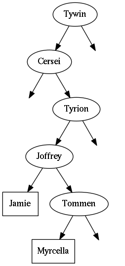

<h2>Table of Contents</h2>

<ul>
<li><a href="#orgheadline1">1. Generic Tree Class</a></li>
<li><a href="#orgheadline4">2. Tree Insertion and Traversion</a>
<ul>
<li><a href="#orgheadline2">2.1. List Extension</a></li>
<li><a href="#orgheadline3">2.2. Example</a></li>
</ul>
</li>
<li><a href="#orgheadline8">3. Graphviz-Output</a>
<ul>
<li><a href="#orgheadline5">3.1. Extension</a></li>
<li><a href="#orgheadline6">3.2. Example</a></li>
<li><a href="#orgheadline7">3.3. Another Example</a></li>
</ul>
</li>
<li><a href="#orgheadline9">4. Application: Huffman-Encoding</a></li>
</ul>

# Generic Tree Class

A simple generic unbalanced binary tree. 

    using System;
    using System.Collections.Generic; 
    
      public class BinaryTree<T> {
    
        public BinaryTree<T> left;
        public BinaryTree<T> right;
    
        public readonly T value;
        Func<T, T, int> comparer; 
    
        public BinaryTree(T value, Func<T, T, int> comparer) {
          this.value = value;
          this.comparer = comparer;
          left = null;
          right = null;
        }
    
        public BinaryTree(T value) : this(value, (x,y) => Comparer<T>.Default.Compare(x,y)) { }
    
        public void Insert(T value) {
          if (comparer(value, this.value) < 0)
          {
            if (left == null) left = new BinaryTree<T>(value, comparer);
            else left.Insert(value);
          }
          else  if (right == null)
            right = new BinaryTree<T>(value, comparer);
          else right.Insert(value);
        }
    
        public void Insert(params T[] values) {
          foreach(T value in values) Insert(value);
        }
      }

# Tree Insertion and Traversion

## List Extension

    using System; 
    using System.Collections.Generic; 
    
    static class BinaryTreeListExtensions {
    
      public delegate void TraversalDelegate<T>(BinaryTree<T> tree, List<T> list); 
    
      private static void TraversePreorder<T>(BinaryTree<T> tree, List<T> list) {
        if (tree.left != null) TraversePreorder(tree.left, list);
        list.Add(tree.value);
        if (tree.right != null) TraversePreorder(tree.right, list); 
      }
    
      private static void TraversePostorder<T>(BinaryTree<T> tree, List<T> list) {
        if (tree.right != null) TraversePostorder(tree.right, list); 
        list.Add(tree.value);
        if (tree.left != null) TraversePostorder(tree.left, list);
      }
    
      private static void TraverseInorder<T>(BinaryTree<T> tree, List<T> list) {
        list.Add(tree.value);
        if (tree.right != null) TraverseInorder(tree.right, list); 
        if (tree.left != null) TraverseInorder(tree.left, list);
      }
    
      public static TraversalDelegate<T> Postorder<T>(this BinaryTree<T> tree) {  // is there a better way to do this? 
        return TraversePostorder<T>; 
      }
    
      public static TraversalDelegate<T> Preorder<T>(this BinaryTree<T> tree) {
        return TraversePreorder<T>; 
      }
    
      public static TraversalDelegate<T> Inorder<T>(this BinaryTree<T> tree) {
        return TraverseInorder<T>; 
      }
    
      public static List<T> ToList<T>(this BinaryTree<T> tree, TraversalDelegate<T> traversalmethod) {
        var list = new List<T>();
        traversalmethod(tree, list);
        return list;
      }
    
      public static List<T> ToList<T>(this BinaryTree<T> tree) {
        return tree.ToList<T>(TraversePreorder<T>);
      }
    
    }

## Example

    using System; 
    
    class TreeTest {
    
      public static void Main()
      {
        var inttree = new BinaryTree<int>(5); 
        inttree.Insert(3);
        inttree.Insert(7);
        inttree.Insert(1);
        inttree.Insert(4);
        inttree.Insert(6);
        inttree.Insert(2);  
        foreach (var i in inttree.ToList()) 
          Console.WriteLine(i);
        foreach (var i in inttree.ToList(inttree.Postorder())) 
          Console.WriteLine(i);
        foreach (var i in inttree.ToList(inttree.Inorder())) 
          Console.WriteLine(i);
    
        var floattree = new BinaryTree<float>(3.14f); 
        floattree.Insert(0.99f, 2.34f, 3.1415f);
        foreach (var f in floattree.ToList()) 
          Console.WriteLine(f);
    
        var lannisters = new BinaryTree<string>("Tywin");
        lannisters.Insert("Cersei","Tyrion","Joffrey");
        lannisters.Insert("Tommen");
        lannisters.Insert("Myrcella");
        lannisters.Insert("Jamie");
        foreach (var s in lannisters.ToList()) 
          Console.WriteLine(s);
        foreach (var s in lannisters.ToList(lannisters.Postorder()))
          Console.WriteLine(s);
    
      }
    }

    mcs demo/treetest1.cs src/binarytree.cs src/binarytreelistextensions.cs 
    mono demo/treetest1.exe

    1
    2
    3
    4
    5
    6
    7
    7
    6
    5
    4
    3
    2
    1
    5
    7
    6
    3
    4
    1
    2
    0,99
    2,34
    3,14
    3,1415
    Cersei
    Jamie
    Joffrey
    Myrcella
    Tommen
    Tyrion
    Tywin
    Tywin
    Tyrion
    Tommen
    Myrcella
    Joffrey
    Jamie
    Cersei

# Graphviz-Output

## Extension

    using System; 
    
    public static class BinaryTreeExtensions {
    
      private static void PrintNode<T>(T rootValue, T childValue) {
        Console.WriteLine("  \"{0}\" -> \"{1}\"", rootValue, childValue);
      }
    
      private static void PrintNode<T>(T value, int empties) {
        Console.WriteLine("  empty{0} [label=\"\", style=invis];", empties);
        Console.WriteLine("  \"{0}\" -> empty{1}", value,  empties);
      }
    
      private static void PrintSubTree<T>(BinaryTree<T> tree, ref int empties) {
    
        if (tree.left == null && tree.right == null) {
          Console.WriteLine("  \"{0}\" [shape=rectangle];", tree.value);
          return;
        }
    
        if (tree.left != null) {
          PrintNode(tree.value, tree.left.value);
          PrintSubTree(tree.left, ref empties);
        } else  if (tree.right != null) {
          PrintNode(tree.value, empties++);
        }
    
        if (tree.right != null) {
          PrintNode(tree.value, tree.right.value);
          PrintSubTree(tree.right, ref empties);
        } else if (tree.left != null) {
          PrintNode(tree.value, empties++);
        }
      }
    
      public static void PrintDot<T>(this BinaryTree<T> tree) {
        Console.WriteLine("digraph G {");
        int empties = 0;
        PrintSubTree(tree, ref empties); 
        Console.WriteLine("}"); 
      }
    }

## Example

Call extension method `PrintDot` and feed the results into [Graphviz](http://www.graphviz.org/): 

    class TreeTest {
      public static void Main() {
        var root = new BinaryTree<int>(5); 
        root.Insert(3,7,1,4,6,2);
        root.PrintDot(); 
      }
    }

    mcs demo/treetest2.cs src/binarytree.cs src/binarytreeextensions.cs 
    mono demo/treetest2.exe

## Another Example

    using System; 
    
    class TreeTest {
    
      public static void Main() {
        var lannisters = new BinaryTree<string>("Tywin");
        lannisters.Insert("Cersei");
        lannisters.Insert("Tyrion");
        lannisters.Insert("Joffrey");
        lannisters.Insert("Tommen");
        lannisters.Insert("Myrcella");
        lannisters.Insert("Jamie");
        lannisters.PrintDot();
      }
    }

    mcs demo/treetest3.cs src/binarytree.cs src/binarytreeextensions.cs 
    mono demo/treetest3.exe

# Application: Huffman-Encoding

    using System;
    using System.Collections.Generic; 
    using System.Linq; 
    
    using StringIntPair = System.Collections.Generic.KeyValuePair<string,int>;
    
    class PriorityQueue<T> { // A poor man's priority queue... 
    
      List<T> list;
      readonly Func<T, T, int> comparer; 
    
      public PriorityQueue(Func<T, T, int> comparer) {
        this.comparer = comparer;
        list = new List<T>();
      }
    
      public T Dequeue() {
        var element = list[list.Count-1];
        list.RemoveAt(list.Count-1); // removal of last element is O(1)
        return element; 
      }
    
      public void Enqueue(T element) { 
        list.Add(element);
        list.Sort((x,y) => -1*comparer(x,y)); // reverse sort order such that smallest element is at end of list
      } 
    
      public int Count {
        get { return list.Count; }
      }
    }
    
    class StringHistogram {
    
      public Dictionary<int, int> dict; 
    
      public StringHistogram(string str) {
        dict = new Dictionary<int, int>(); 
        foreach(var c in str.ToCharArray()) {
          dict[c] = dict.ContainsKey(c) ? dict[c]+1 : 1; 
        }
      }
    }
    
    class Huffman {
    
      public static void Main() {
        StringHistogram hist = new StringHistogram("a fast runner need never be afraid of the dark"); 
    
        Func<StringIntPair, StringIntPair, int> comparer = (x,y) => x.Value - y.Value; 
        var PQ = new PriorityQueue<BinaryTree<StringIntPair>>((x,y) => comparer(x.value, y.value));
        foreach(var element in hist.dict) {
          PQ.Enqueue(new BinaryTree<StringIntPair>(new StringIntPair(((char)element.Key).ToString(),element.Value), comparer));
        }
    
        while (PQ.Count > 1) {
          var T1 = PQ.Dequeue();
          var T2 = PQ.Dequeue();
          var newRoot = new BinaryTree<StringIntPair>(new StringIntPair(T1.value.Key + T2.value.Key, T1.value.Value+T2.value.Value), comparer);
          newRoot.left = T1;
          newRoot.right= T2;
          PQ.Enqueue(newRoot);
        }
        PQ.Dequeue().PrintDot();
      }
    }

    mcs demo/huffman.cs src/binarytree.cs src/binarytreeextensions.cs
    mono demo/huffman.exe

